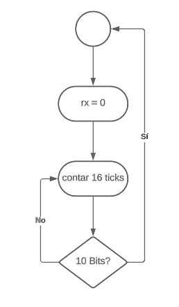

# Sistema-de-seguridad-para-casa-rural

**Laboratorio Electrónica Digital I**

**Proyecto Final: Cerradura Digital**

Programa de:

Ingeniería Mecatrónica

**Samara Gabriela Cespedes Afanador**

**Juan Felipe Triana Aguilera**

**Fernando Cárdenas Acosta**

Profesor:
**Diego Alexander Tibaduiza Burgos**

Materia: Electrónica Digital I

Universidad Nacional de Colombia

Bogotá D.C.

Facultad de Ingeniería

2023

Proyecto de Electrónica Digital 1.

# Planteamiento del problema.
Las comunidades que residen en zonas rurales de Colombia se encuentran amenazadas por la inseguridad y la desconexión con las autoridades, por estas razones son vulnerables a robos y otros delitos, debido a la falta de medidas de seguridad adecuadas, la distancia y la escasa presencia policial en estas zonas. 
Estas áreas son más propensas a los robos debido a su aislamiento, lo que les hace un objetivo fácil para los delincuentes que buscan cometer crímenes sin ser descubiertos. De acuerdo con el último registro compartido por la Policía Nacional, este año se han denunciado más de 20.275 hurtos a viviendas (alrededor de un caso cada 20 minutos). [1]

El informe indica que, en 2020, se registraron 16.408 casos de hurto a viviendas en zonas rurales de Colombia, lo que representa un aumento del 10,7% en comparación con el año 2019, cuando se registraron 14.823 casos.[2]

## Análisis pestal

Político:

El abandono estatal y aislamiento de las comunidades que residen en zonas rurales ocasiona que dichas áreas sean un foco de delincuencia y crimen organizado. Las políticas implementadas por el gobierno nacional son insuficientes para mitigar esta problemática, lo cual representa simple vista como una brecha significativa en términos de acceso a servicios básicos, oportunidades económicas y seguridad.

Económico:

El hurto a pobladores de zonas rurales constituye un revés a la maquinaria base de la economía nacional, ya que estas personas son quienes producen las materias primas necesarias tanto para alimentación como para manufactura de productos industriales, por tanto, si este grupo encuentra amenazada la realización de sus actividades económicas, repercute de forma adversa en la macroeconomía del país.

Generalmente, las personas que habitan en zonas rurales, son personas que no cuentan con una gran cantidad de recursos económicos, por lo que se debe intentar hacer la implementación de la solución debe ser lo más económica posible.

Social:

Las zonas rurales de Colombia a menudo son más propensas a la violencia y el conflicto armado, lo que puede afectar la seguridad de las personas y las oportunidades económicas. La falta de presencia policial y la presencia de grupos armados ilegales han contribuido al abandono del gobierno nacional hacia estas áreas y poca accesibilidad a apoyo policial inmediato. Lo anterior, implica un impacto negativo en la calidad de vida de estos habitantes y en su capacidad para llevar a cabo sus actividades diarias de manera efectiva.

Tecnológico:

La falta de una infraestructura adecuada en áreas rurales, como iluminación pública, servicios básicos, sistemas de vigilancia y acceso limitado a servicios de emergencia, se traduce como un agravante para la problemática de inseguridad y robos a viviendas en dichas zonas.

Ambiental:

En áreas rurales, es posible que las condiciones de la infraestructura para la población objetivo del proyecto sean malas, por lo que fenómenos ambientales podrían afectar al sistema, aun si este se encuentra dentro de un espacio cerrado.

Legal 

Ley 1551 de 2012: establece que todas las empresas de seguridad privada deben estar registradas ante la Superintendencia de Vigilancia y Seguridad Privada, y que los equipos de seguridad utilizados en las viviendas deben cumplir con las normas técnicas y de seguridad establecidas.

## Antecedentes

Según el Departamento Administrativo Nacional de Estadística (DANE) de Colombia, en el año 2022 en las zonas rurales de Colombia se ubica el 23,7% de la población del país, lo que representa unos 12,2 millones de personas, por la lejanía y falta de control estas viviendas se encuentran expuestas a hurtos y saqueos que en casos se ve comprometida la integridad de las personas en el lugar de los hechos. Según un informe de seguridad superior en Colombia, las estadísticas generales respecto al robo con violencia son alarmantes en sí mismas, el robo específico a inmuebles últimamente está prendiendo las alarmas de las autoridades, en especial debido al aumento de casos que suele presentarse en época de vacaciones. De acuerdo con el último registro compartido por la Policía Nacional, este año se han denunciado más de 20.275 hurtos a viviendas (alrededor de un caso cada 20 minutos). [1][2]

## Solución

Implementación de un sistema de seguridad capaz de avisar que se está llevando a cabo un robo en una vivienda.

## Objetivos

General

Diseñar un sistema de seguridad para viviendas en zonas rurales en Colombia.

Específicos

Obtener un diseño accesible, replicable e implementable por personas que habiten en zonas rurales
Implementar en el diseño conocimientos de lógica combinacional y secuencial 

## Actores

Habitantes de zonas rurales: son los consumidores del producto, con el cual buscan obtener una mayor seguridad en sus hogares.

## Presupuesto

| Elemento                             | Precio      |
| ------------------------------------ | ----------- |
| FPGA                                 | \$679.058   |
| Magnetic Door Window Contact Reed Switch| \$44.365 |
| Breadboard                      | \$58.806 |
| Breadboard jumper wires           | \$23.043  |
| 10x 40-Pin Male Header 0.1" (2.54mm)                     | \$15.392     |
| Servo           | \$45.225    |
| Adjust IR Pyroelectric Infrared IR PIR Motion Sensor            | \$36.216    |
| Active Buzzer Alarm Module Sensor Beep       | \$27.117   |
| Bidirectional logic level conversor 5 TO 3,3 OR 3,3 TO 5 V      | \$11.000   |
| Bluetooth module HC-06   | \$18.999 |
| 220 ohms resistor   | \$100 |
| 4.7k Potential meter   | \$500 |
| Balsa Wood sheets  | \$25.000 |
| Porcelainron   | \$16.500 |
| Balsa wood glue  | \$9.100 |
| Clamp and lace  | \$2.900 |
| Tools   | \$30.199 |
| **Total**                            | **\$832.466** |

## Diagramas.

Diagrama de caja negra.

Diagrama de caja gris.

Diagrama de estados de la contraseña.

Diagramas de estados de la transmisión UART.

Diagrama Algorítmico.

Diagrama FSM.

Diagramas de estados de la recepción UART.

Diagrama Algorítmico.

Diagrama FSM.

## Simulaciones
Se muestra la simulación de los componentes "sistema", el cual gestiona la activación del sistema mediante una clave, y el cambio de esta; y "transmisión" el cual a partir de la información recolectada por los sensores, transmite datos a un celular.

Simulación de "sistema"

En las imagenes anteriores, se puede observar como dependiendo de la clave ingresada, y de las entradas comprobar y cambiar, varían los valores de la clave misma, el estado del sistema, y la alarma (la alarma está en estado activo cuando su valor es 0). La alarma se activa cuando se cometen 3 errores al intentar ingresar la clave.

Simulación de "transmisión"

Acá se puede observar que, siendo start el dato enviado por el sensor PIR y que un 1 es que detecta presencia, entonces tx va a transmitir información (tx = 0) cuando el PIR detecta presencia, y no transmitirá cuando el PIR no detecte.

## Fotografías del montaje

## Video de funcionamiento

## Bibliografía

1.Seguridad Superior. (2021). Cifras de inseguridad y robo en Colombia. Recuperado el 7 de mayo de 2023, de https://www.seguridadsuperior.com.co/cifras-de-inseguridad-y-robo-en-colombia

2.Departamento Administrativo Nacional de Estadística (DANE). (2019). Encuesta de convivencia y seguridad ciudadana (ECSC) 2019: Bolívar. Recuperado el 7 de mayo de 2023, de https://www.dane.gov.co/files/investigaciones/poblacion/convivencia/2019/Bol_ECSC_2019.pdf

